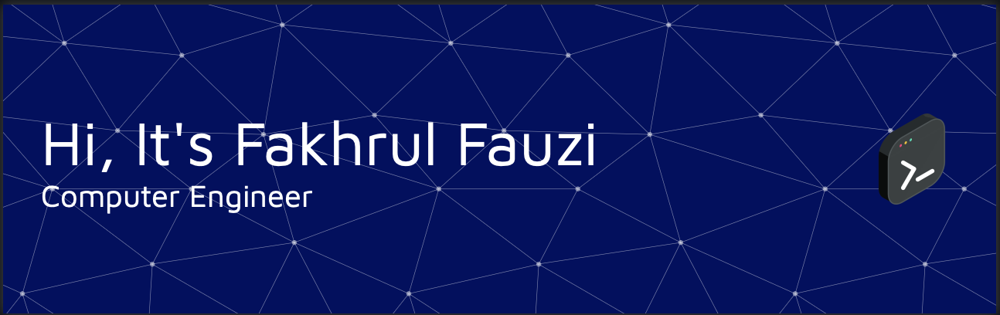

> Breathing life into pixels, one line of code at a time.

### 🧠 Graduating Computer Engineer | 📱 iOS Developer | 🤖 AI/ML Enthusiast | 📸 Photographer

---

## 🚀 About Me

I'm a graduating Computer Engineer from UTeM with a passion for creating digital experiences at the intersection of technology and creativity. By day, I craft AI-powered applications that solve real-world problems; by night, I capture moments through my camera lens, finding beauty in both code and composition.

When I'm not training ML models or debugging code, you'll find me designing websites, exploring new technologies, or sipping coffee while planning my next project. I believe in the power of technology to transform ideas into impact.

## 💻 Tech Stack

## 📈 GitHub Stats

## 🌐 Connect With Me

## 🔎 Employer?
> [!IMPORTANT]  
> <a href="./assets/Resume_Fakhrul_Fauzi_May25.pdf" download>Download my resume</a>

---

> "At the intersection of engineering and artistry, I build digital solutions that make life more colorful." 📱✨
